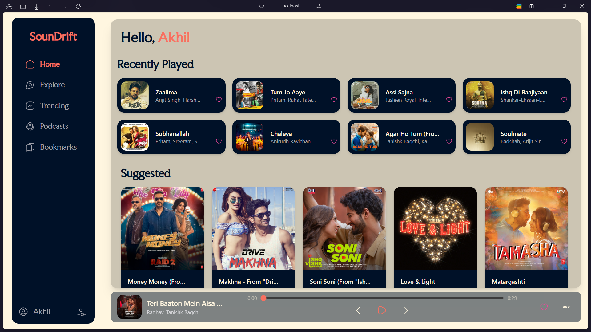
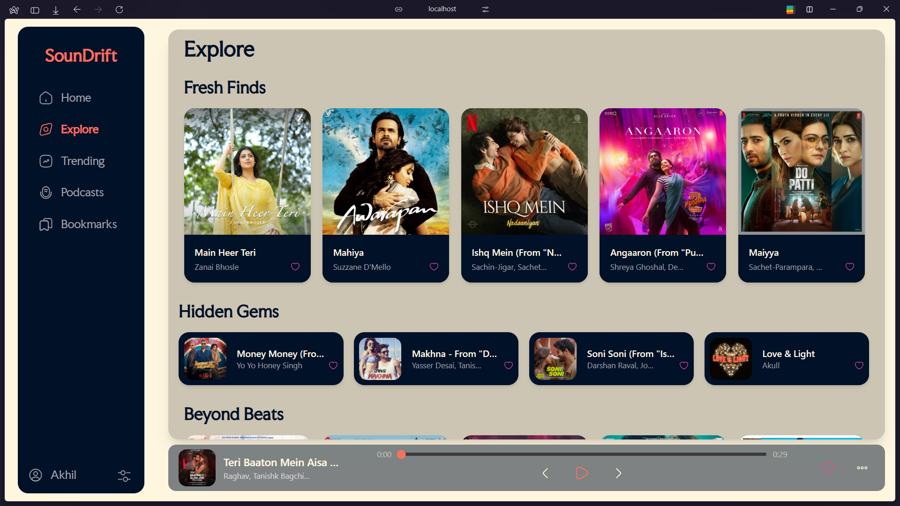
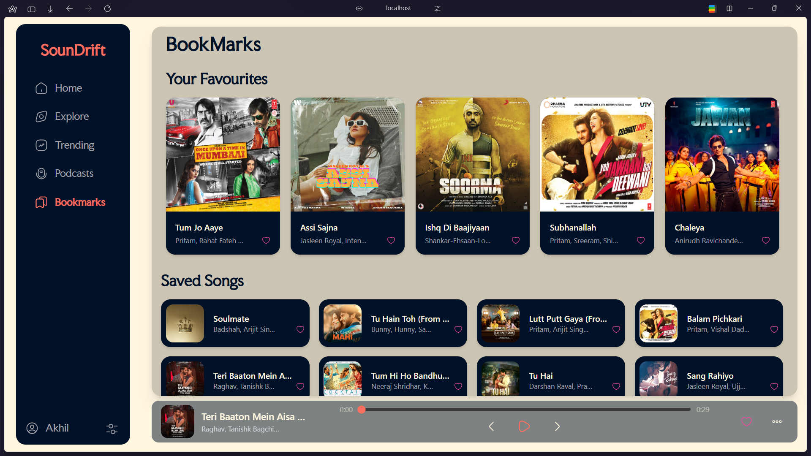

# 🎵 SounDrift-Music Player Web App

A sleek and modern **React.js** based music player frontend that showcases trending songs, explore new tracks, and manage bookmarks — all designed with a beautiful horizontal and vertical card layout.

---

## ✨ Features

- 🎶 Explore trending songs with eye-catching music cards
- 🎨 Smooth hover effects revealing Play action
- ❤️ Bookmark your favorite tracks
- 📚 Modular component structure (MusicCard, MusicCardHorizontal, MusicSection, etc.)
- 🖌️ Fully responsive and lightweight design
- 🎷 Data fetched dynamically from JSON
- 🔥 Icons powered by **iconsax-react**

---

## 📂 Project Structure

```
/public
/src
  ├── assets/
  ├── components/
  │     ├── MusicCard.jsx
  │     ├── MusicCardHorizontal.jsx
  │     ├── MusicSection.jsx
  │     └── MusicSectionHorizontal.jsx
  ├── data/
  │     └── songs.json
  ├── App.jsx
  └── index.html
```

---

## 🛠️ Tech Stack

- **React.js**
- **TailwindCSS** (for styling)
- **Iconsax-react** (for icons)
- **JSON** (for song data)

---

## 🚀 Getting Started

### 1. Clone the repo

```bash
git clone https://github.com/Jayanth4109/SoundDrift-MusicPlayer.git
cd your-repo-name
```

### 2. Install dependencies

```bash
npm install
```

### 3. Run the app

```bash
npm run dev
```

(Or `npm start` if you use Create-React-App)

---

## 📸 Preview








---

## 📜 License

This project is licensed under the MIT License - feel free to use and modify!

---

## 👍🏻 Acknowledgments

- Inspired by popular music apps like Spotify and Apple Music UI
- Designed with a focus on clean UX and playful interactivity ✨

---

